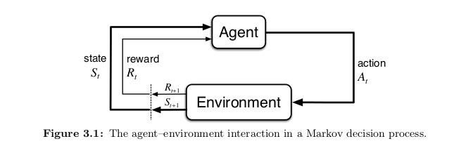

# Chapter 03: Finite Markov Decision Processes

- **Bandit**: estimated value $q*(a)$ of each eaction $a$
- **MDP**: estimate the value $q*(s, a)$ of each ation $a$ in each state $s$, or the value $v*(s)$ of each state given optimal action selections

- breadth of applicability v.s. mathematical tractability

## 3.1 The Agent-Environment Interface
 

- **trajectory**: $S_0, A_0, R_1, S_1, A_1, R_2, S_2, A_2, R_3, ...$

##### *dynamics fucntion* of the MDP
For particular values of random variables, $s' \in S, r \in R$, there is a probability of those values occurring at time $t$, given particular values of the preceding state and action:

$$p(s', r | s, a) = Pr\left\{S_t=s', R_t=r | S_{t-1}=s, A_{t-1}=a\right\}$$

##### Markov property
- The probability of each possible values for $S_t$ and $R_t$ depends only on the immediately preceeding state and action, $S_{t-1}, A_{t-1}$.
- The state must inlude infomation about all aspects of the past agent-environment interaction that make a difference for the future.

##### *state-transition probabilities*
$$p(s'|s, a) = Pr\left\{S_t=s'|S_{t-1}=s, A_{t-1}=a\right\} = \sum_{r \in R} r \sum_{s' \in S} p(s', r | s, a)$$

##### expected rewards for state-action
$$r(s, a) = \mathbb{E}\left[R_t | S_{t-1}=s, A_{t-1}=a\right] = \sum_{r \in R} r \sum_{s' \in S} p(s', r | s, a)$$

##### expcetd rewards for state-action-next-state
$$r(s, a, s') = \mathbb{E}\left[R_t  | S_{t-1}=s, A_{t-1}=a, S_t=s'\right] = \sum_{r \in R} r \frac{p(s', r|s, a)}{p(s'|s, a)}$$

##### Agent-Environment boundary
- represents the limit of the agent's absolute control
- anything that cannot be changed arbitrarily by the agent is considered to be environment
- can be at different places for different purposes

TODO: Exercise 3.4

## 3.2 Goals and Rewards

##### Reward Hypothesis
Maximization of the expcted value of the cumulative sum of reward

The reward signal is a way of communicating to the robot **what** you want it to achieve, not **how** you want it achieved.

## 3.3. Returns and Episodes

##### Episodic tasks
- next episode begins independently of how the previous one ended
- i.e. games, maze
- finite number of rewards subsequently received during the episode
$$G_t = R_{t+1} + R_{t+2} + R_{t+3} + ... + R_T$$

##### Continuing tasks
- $T = \infty$

##### Discounting Return
$$G_t = R_{t+1} + \gamma R_{t+2} + \gamma^2 R_{t+3} + ... = \sum_{k=0}^\infty \gamma^k R_{t+k+1} = R_{t+1} + \gamma G_{t+1}$$

###### Exercise 3.7
- the reward only considers escaping the maze, not the number of moves it makes before actually escaping

## 3.4 Unified Notation for Episodic and Continuing Tasks

$$G_t = \sum_{k=t+1}^T \gamma^{k-t-1}$$

including $T = \infty$ or $\gamma = 1$

## 3.5 Policies and Value Functions
Estimating **value functions** - functions of states (or state-action) that estimate how good it is for the agent to be in a given state (or how good it is to perform a given action in a given state).

- **policy**: mapping from states to probabilities of selecting each possible action $\pi(a|s)$

##### $v_{\pi}(s)$: state-value function for policy $\pi$
$$v_{\pi}(s) = \mathbb{E} [G_t | S_t = s] = \mathbb{E}_{\pi} \left[\sum_{k=0}^{\infty} \gamma^k R_{t+k+1} | S_t = s \right]$$

- expected return when starting in $s$ and following $\pi$

##### $q_{\pi}(s, a)$: action-value function for policy $\pi$
$$q_{\pi}(s, a) = \mathbb{E}_{\pi} \left[ G_t | S_t=s, A_t = a \right] = \mathbb{E}_{\pi} \left[ \sum_{k=0}^{\infty} \gamma^k R_{t+k+1} | S_t=s, A_t = a \right]$$

- value of taking action $a$ in state $s$ under a policy $\pi$

##### Relationships
$$v_{\pi} (s) = \sum_{a \in A} \pi(a|s) \cdot q_{\pi}(s, a)$$

##### Recursive Property (Bellman equation)
$$v_{\pi}(s) = \sum_a \pi(a | s) \sum_{s', r} p(s', r | s, a) \left[r + \gamma v_{\pi}(s')\right]$$

TODO: Exercise 3.18, 3.19

## 3.6 Optimal Policies and Optimal Value Functions

##### Optimal Policies $v*(s)$
$$v*(s) = \operatorname*{max}_{\pi} v_{\pi}(s)$$

$$v*(s) = \operatorname*{max}_{a} \sum_{s', r} p(s', r | s, a) [r + \gamma v*(s')]$$

##### Optimal action-value function $q_*(s, a)$
$$q*(s, a) = \mathbb{E} \left[R_{t+1} + \gamma v_*(S_{t+1}) | S_t=s, A_t = a \right]$$

$$q*(s, a) = \sum_{s', r}p(s', r|s, a) \left[r + \gamma \operatorname*{max}_{a'}q_*(s', a')\right]$$

##### Assumptions to solve explicitly for solution
- we accurately know the dynamics of the environment
- we have enough computational resources to complete the computation of the solution
- the Markov property

## 3.7 Optimality and Approximation
- online nature of reinforcement learning makes it possible to approximate optimal policies in ways that put more effort into learning to make good decisions for frequently encountered states, at the expense of less effort for infrequently encountered states.

## 3.8 Summary
- RL: learning from interaction how to behave in order to achieve a goal
- RL *agent* and its *environment* interact over a sequence fo discrete time steps
- **actions** are choices made by the agent
- **states** are basis for making the choices
- **rewards** are basis for evaluating the choices
- **policy** is a stochastic rule by which the agent selected actions as a function of states
- agent's objective is to maximize the amount of reward it receives over time

- finite MDP = MDP with finite state, action, reward sets
- **return** is the function of future rewards that the agent seeks to maximize (in expected value)
  - **undiscounted** for episodic tasks (breaks natually into episodes)
  - **discounted** for continuing tasks (continues without limitt)

- a policy's **value functions** assign to each state, the expected return from that state, given that the agent uses the policy
  - **optimal value functions** assignes the largest expected return achievable any any policy
- **Bellman optimality equations** are special consistency conditions that the optimal value functions must satisfy and that can be solved for the optimal value functions
- **complete knowledge** of the environment's dynamics $p(s', r | s, a)$
  - still unable to solve due to memory/cpu
  - approximations must be made

- RL: concerned with cases in which optimal solutions cannot be found but must be approximated in some way
