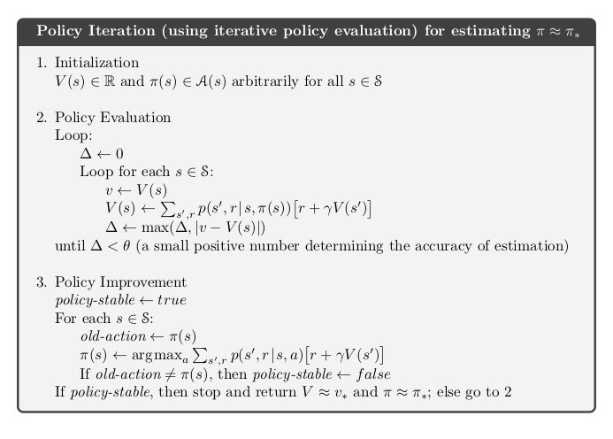
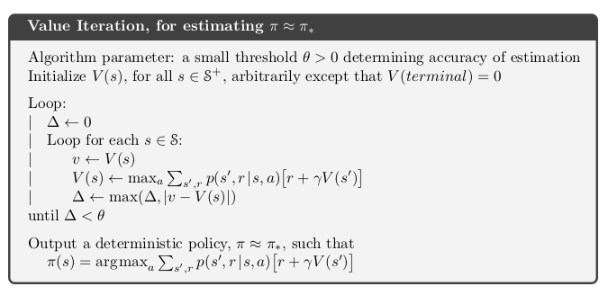
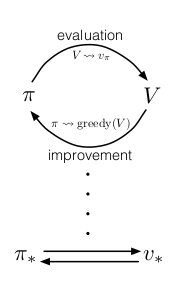

# Chapter 04 - Dynamic Programming

Algorithms used to compute optimal policies given a perfect model of the environment (i.e. MDP)
- assumption of perfect model
- greaet computational expense

Assume finite MDP:
  - state, actions, rewards $S, A, R$ finite
  - dynamics given by $p(s', r, |s, a)$

##### Key Idea
- Use of value functions to organize and structure the search for good policies
- Easily obtain optimal policies once we found the optimal value functions $v_*$ or $q_*$

$$v_*(s) = \operatorname*{max}_a \mathbb{E}[R_{t+1} + \gamma v_*(S_{t+1}) | S_t = s, A_t = a]$$
$$= \operatorname*{max}_a \sum_{s', r} p(s', r | s, a) \left[r + \gamma v_*(s') \right]$$

$$q_*(s, a) = \mathbb{E} \left[R_{t+1} + \gamma \operatorname*{max}_{a'} q_*(S_{t+1}, a') | S_t=s, A_t=a \right]$$
$$= \sum_{s', r} p(s', r | s, a) \left[r + \gamma \operatorname*{max}_{a'} q_*(s', a') \right]$$

## 4.1 Policy Evaluation (Prediction)

##### Compute state-value function $v_{\pi}$ for policy $\pi$

$$v_{\pi}(s) = \sum_a \pi(a|s) \sum_{s', r}p(s', r | s, a) \left[r + \gamma v_{\pi}(s')\right]$$

##### Iterative Policy Evaluation
Sequence of approximate value functions $v_0, v_1, v_2, ...$
###### Update Rule (Expcted Update)
$$v_{k+1}(s) = \sum_a \pi(a|s) \sum_{s', r}p(s', r|s, a) \left[r + \gamma v_k(s')\right]$$

- $\{v_k\}$ converge to $v_{\pi}$ as $k \rightarrow \infty$

## 4.2 Policy Improvement

##### Polic Improvement Theorem
Let $\pi$ and $\pi '$ be any pair of deterministic policies such that:
$$q_{\pi}(s, \pi '(s)) \geq v_{\pi} (s)$$
Then policy $\pi '$ must be as good as $\pi$
$$v_{\pi '} \geq v_{\pi}(s)$$

##### Greedy Policy
Consider changes to all states and to all possible actions, selecting at each state the action that appears best according to $q_{\pi}(s, a)$

$$\pi ' (s) = \operatorname*{argmax}_a q_{\pi}(s, a)$$

- idea can be extended to stochastic policies, suboptimal actions are given zero probability

## 4.3 Policy Iteration

TODO: Exercise 4.7

## 4.4 Value Iteration
- Policy evaluation step of policy iteration can be truncated in several ways without losing the convergence guarantees of policy iteration

##### Value Iteration Update Rule
Combines the policy improvement and truncated policy evaluation steps

$$v_{k+1}(s) = \operatorname*{max}_a \mathbb{E} \left[R_{t+1} + \gamma v_k(S_{t+1}) | S_t=s, A_t=a \right]$$

$$= \operatorname*{max}_a
 \sum_{s', r} p(s', r | s, a) \left[r + \gamma v_k(s') \right]$$

- turning the Bellman optimality equation into an update rule

- faster convergence achieved by interposing multiple policy evaluation sweeps between each policy improvement sweep.
- converge to an optimal policy for discounted finite MDPs

## 4.5 Asynchronous Dynamic Programming

##### Drawback to DP
- involve operations over the entire state set
- require sweeps of the state set
- large state set $\rightarrow$ expensive

##### Asynchronous DP
- in-place iterative DP algorithms
- update the values of states in any order, using whatever values of other states happen to be available
- values of some states may be updated several times before the values of others are updated once
- does not need to get locked into any hopeless long sweep before it can make progress improving a policy

##### Intermix computation with real-time interaction
- run an iterative DP at the same time that an agent is actually experiencing the MDP
- agent's experience can be used to determine the states to which the DP algorithm applies its updates
- updates the states as agent visits them
- focus the DP algorithm's updates onto parts of the state set that are most relevant to the agent

## 4.6 Generalized Policy Iteration

##### Generalized Policy Iteration
Letting policy-evaluation and policy-improvement interact, independent of the granularity and other details of the two processes

- identifiable policies and value functions
- policy always being improved with respect to the value function
- value function always being driven toward the value function for the policy
- both evaluation and improvement process stabalize when the value function and policy is optimal

## 4.7 Efficiency of Dynamic Programming
Worst Case: polinomial in the number of states $n$ and actions $k$ ($O(f(n, k))$)

- DP: exponentially faster than any direct search in policy space
  - direct search would have to exhaustively examin each policy to provide the same guarantee
  - lineart programming methods to solve MDP: impractical at a much smaller number of states
  - DP comparatively better suited to handling large state spaces than competing methods such as direct search and linear programming

##### Curse of dimensionality
- number of states grow exponentially with the number of state variables

##### DP in practice
- solve MDPs with million of states (policy iteration, value iteration)
- asynchronous DP methods preferred on problems with large state spaces

## 4.8 Summary
- **policy evaluation**: iterative computation of the value functions for a given policy
- **policy improvement**: computation of an improved policy given the value function for that policy
- policy evaluation + policy improvement $\implies$ **policy iteration** or **value iteration**

- **generalized policy iteration (GPI)**: general idea of two interacting processes revolving around an approximate policy and an approximate value function
  - one process takes the policy as given and performs policy evaluation, changing the value fuinction to be more like the true value function for the policy
  - one process takes the value function as given and performs policy improvement, changing the policy to make it better assuming that the value function is its value function
  - converge to an optimal solution
- **asynchronous DP** methods: in-place iterative methods that update states in an arbitrary order, fine-grained forms of GPI

- **bootstrapping**: all of DP methods update estimates on the basis on estimates of the value of successor states
  -

---
